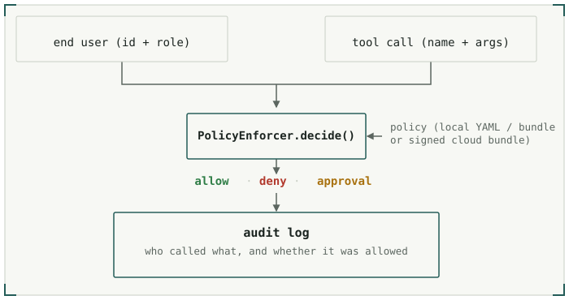

<div align="center">


# Hexgate

**Runtime authorization for AI agents.**
On every tool call, Hexgate decides whether *this user*, in *this role*, may run *this tool* with *these arguments* — allow, deny, or require approval. For OpenAI Agents, LangChain, Google ADK, Pydantic AI, or a native runtime.

[**Website**](https://hexgate.ai) · [**Docs**](https://docs.hexgate.ai)
<br>
[](https://pypi.org/project/hexgate/)
[](https://github.com/HexamindOrganisation/hexgate/actions/workflows/tests.yml)
[](https://codecov.io/gh/HexamindOrganisation/hexgate)
[](https://pypi.org/project/hexgate/)
[](LICENSE)

<br />


</div>

---

## What is Hexgate?

Hexgate is two things that move together:

- **`hexgate` — the SDK.** A Python runtime that gates every tool call through a typed `Decision` (allow / deny / approval-required), resolving the caller's role at call time to apply that role's rules. Wrap an existing agent without rewriting it, or build one natively — every decision is traced and audited with the caller's identity. [See supported frameworks →](https://docs.hexgate.ai/adapters/openai)
- **The Hexgate platform** *(optional)* — a FastAPI control plane + React dashboard for editing policy in a browser, minting per-project tokens, watching live decisions stream from a serving agent, and shipping signed WASM policy bundles to production. Available as **[Hexgate Cloud](https://app.hexgate.ai)** (hosted — set one env var, no infra) or self-hosted.

You can use the SDK three ways: **local** (YAML/bundle on disk, no platform), **Hexgate Cloud** (remote enforcement + audit — just set `HEXGATE_API_KEY`), or **self-hosted** (run the control plane yourself). `HEXGATE_API_URL` defaults to `https://app.hexgate.ai`, so remote enforcement is one env var away.

<picture>
  <source media="(prefers-color-scheme: dark)" srcset="./assets/decision-flow-dark.svg">
  
</picture>

## Quickstart

```bash
pip install hexgate
```

**See it enforce — no API keys.** Save a policy that gives two roles different
limits on the *same* `refund_order` tool:

<!-- Keep this refund_order policy example in sync with docs/quickstart.mdx -->
```yaml
# policy.yaml
version: 1
roles:
  support:                                     # small USD refunds only
    default_policy: { mode: deny }
    tools:
      refund_order:
        mode: allow
        constraints:
          - args.amount <= 50
          - args.currency == "USD"
  billing:                                     # larger refunds, major currencies
    default_policy: { mode: deny }
    tools:
      refund_order:
        mode: allow
        constraints:
          - args.amount <= 500
          - args.currency in ["USD", "EUR"]
```

`hexgate policy test` decides the **same $400 refund** for each role offline — no model, no keys:

```bash
hexgate policy test policy.yaml --role support \
    --tool refund_order --args '{"amount": 400, "currency": "USD"}'
# ✗ DENY · support → refund_order({"amount": 400, "currency": "USD"})
#   reason: Policy on "refund_order" denied: constraint failed — args.amount <= 50

hexgate policy test policy.yaml --role billing \
    --tool refund_order --args '{"amount": 400, "currency": "USD"}'
# ✓ ALLOW · billing → refund_order({"amount": 400, "currency": "USD"})
```

Same tool, same request — **the caller's role and the arguments decide**, enforced
outside the model. The [full quickstart →](https://docs.hexgate.ai/quickstart) puts
this in front of a live agent.

## Documentation

Full documentation lives at **[docs.hexgate.ai](https://docs.hexgate.ai)**.

| | |
|---|---|
| [Build an agent](https://docs.hexgate.ai/guides/build-an-agent) | Define tools directly with `create_agent`, or wrap an existing framework agent. |
| [Framework adapters](https://docs.hexgate.ai/adapters/openai) | OpenAI Agents, LangChain/LangGraph, Google ADK, Pydantic AI. |
| [Policy](https://docs.hexgate.ai/policy/yaml-shape) | YAML shape, constraints, WASM bundles, signing, local override. |
| [User scope + roles](https://docs.hexgate.ai/concepts/user-scope) | Per-request identity, role resolution, biscuit attenuation. |
| [CLI](https://docs.hexgate.ai/cli/chat) | `chat`, `serve`, `register`, `policy`. |
| [MCP servers](https://docs.hexgate.ai/concepts/mcp) | Wrap any Model Context Protocol server as policy-enforced tools. |
| [Hexgate Cloud (hosted)](https://docs.hexgate.ai/platform/hosted) | Remote policy enforcement + audit with zero infra — get a key, set one env var. |
| [Platform (self-hosted)](https://docs.hexgate.ai/platform/overview) | Run the control plane, dashboard, ClickHouse audit, and Resend email yourself. |

## Development

Contributor setup, `make` targets, and the test suites are documented in
[Development & testing](https://docs.hexgate.ai/internals/development). The short
version:

```bash
make install-dev     # uv sync --extra dev (first time only)
make check           # lint + fmt-check + test (matches CI)
```

## License

MIT — see [LICENSE](LICENSE).

---

If Hexgate looks useful, [give it a ⭐ on GitHub](https://github.com/HexamindOrganisation/hexgate) — it helps more than you'd think. Built by [Hexamind](https://hexgate.ai).
